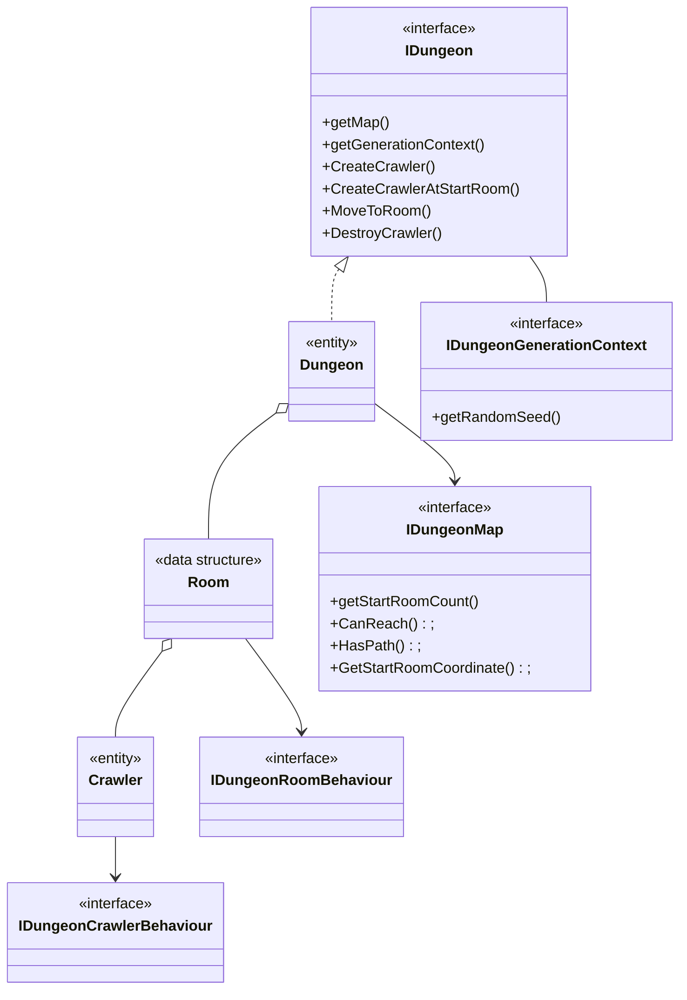
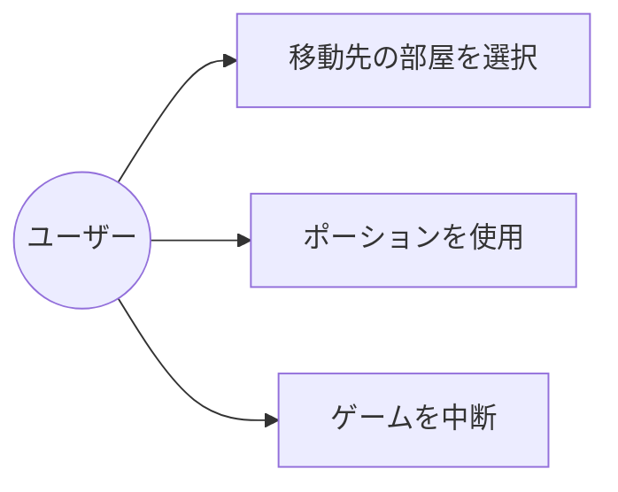

# Dungeon Crawler（マップ探索システム）の設計

プレイヤーがダンジョン内のルーム間を探索するための基盤を提供します。
詳細なコントラクトについては、Assets/Project/Scripts/Domain/DungeonCrawl/Interfaces/を参照します。

## 🏗️ 設計概要

- **IDungeon**: ダンジョン全体を管理するインターフェース。マップや生成コンテキストへのアクセスを提供。
- **Dungeon**: ダンジョンの具体的な実装。ルームやクロウラーのライフサイクルを管理。
- **Room**: ダンジョン内の1つのルームを表現するデータ構造。ルームの状態やクロウラーを保持。
- **Crawler**: プレイヤーや敵など、ダンジョン内を移動するクロウラー。
- **IDungeonMap**: ダンジョンのマップ構造を表現するインターフェース。
- **IDungeonRoomBehaviour**: ルームの振る舞いを定義するインターフェース。
- **IDungeonCrawlerBehaviour**: クロウラーの振る舞いを定義するインターフェース。
- **IDungeonGenerationContext**: ダンジョン生成時のコンテキスト（例: ランダムシード）を提供

## 設計のポイント

**ルームとクロウラーの一元管理**
- ルームやクロウラーの状態変更は、Dungeonクラス内で一括して管理され、外部から直接変更されない
    - （SRPに違反しているようにも捉えられますが、セキュリティやトランザクション管理の観点から必要な妥協としています。）

**拡張性のポイント**
- 新しいルームの振る舞いを追加する場合は、IDungeonRoomBehaviourを実装したクラスを作成し、Roomに注入

## ユースケース

- プレイヤーが部屋を移動すると、MoveToRoom メソッドが呼ばれ、現在の部屋が更新される。
- その後、IDungeonRoomBehaviour を通じて、その部屋のイベントやギミックが処理される。