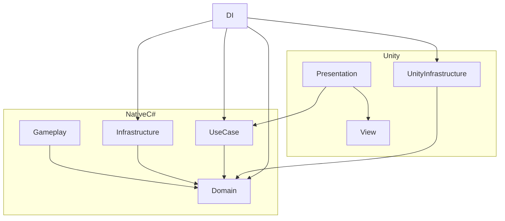

# デッキ構築型ローグライクゲームのデモ

これはUnityで作成されたデッキ構築型ローグライクゲームのデモプロジェクトです。

## 🎮 はじめに

デッキ構築型ローグライクゲーム、"[Slay the Spire](https://store.steampowered.com/app/646570/Slay_the_Spire/?l=japanese)"を参考にしたゲームをUnityプロジェクトとして実装します。

複雑な状態管理やルールの組み合わせを整理し、レベルデザイナやアーティストとの連携を考慮した、柔軟で拡張性のある設計をします。

## 🚀 開発環境

- Unity 6 6000.0.20f1
- 依存ライブラリ
    - [Extenject](https://assetstore.unity.com/packages/tools/utilities/extenject-dependency-injection-ioc-157735)（依存性注入）
    - [UniRx](https://assetstore.unity.com/packages/tools/integration/unirx-reactive-extensions-for-unity-17276)（リアクティブプログラミング）
    - [DOTween](https://assetstore.unity.com/packages/tools/animation/dotween-hotween-v2-27676)（アニメーション管理）

## 🖼 完成品

スクリーンショットを随時追加予定！📸✨

## 🏗️ 設計

### 📌 アーキテクチャの概要

- **Gameplay 層**: Domainから独立し、カードなどのコンテンツを実装。レベルデザイナと協力しやすい設計。
- **UnityInfrastructure層**: Unity依存のリソース読み込みや管理を担当。

### 🔍 メカニクスの設計

### ☝️ 設計のポイント

**拡張性**
- **柔軟な設計**: AWSなどの外部APIと接続可能。
- **Unity への低依存**: プラットフォームが変わっても、C#のビジネスロジックはそのまま利用可能。
- **オンライン対応可能**: ユースケースがサーバーファサードとして機能し、サーバー側でセキュアな処理が実行可能。

**共同開発体制**
- **フロントエンドの独立**:UI層にはMVPパターンを採用し、Unityエンジニアがビジネスロジックを気にせず開発可能。
- **ゲームデザイナーとの連携**: カードデータはテキストファイルで管理し、コーディング不要でバランス調整が可能。
- **簡単なコンテンツ追加**: 新しいカードやイベントはGameplay層を更新するだけでOK！

## 🛠 実装

詳しい実装内容は、[Assets/Project/Scripts/](Assets/Project/Scripts/)以下のソースコードとコメントを参照してください。
